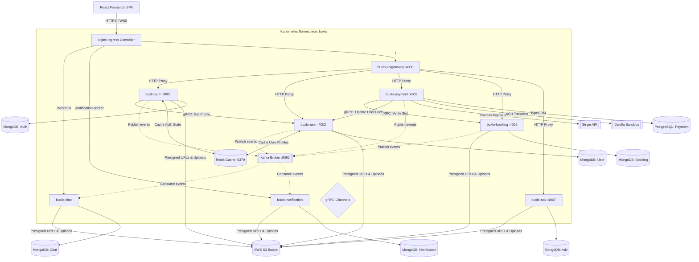

# BUXLO — Personalized Finance Monitoring & Mentorship Platform

BUXLO is a high-performance, enterprise-grade, personalized financial monitoring and mentorship platform. Built using a distributed **Microservices Architecture** on top of **Node.js, TypeScript, and React**, the platform leverages **event-driven design** (Apache Kafka), **in-memory caching** (Redis), **relational and non-relational database models** (PostgreSQL + MongoDB), and robust **gRPC** interfaces for high-throughput, low-latency service-to-service communication.

---

## 🏗️ System Architecture

BUXLO is designed to be highly scalable, fault-tolerant, and easy to deploy. Below is an overview of the platform's architectural topology, including client request flow, message routing, inter-service gRPC communication, and persistence layers.



---

## 🛠️ Microservices Ecosystem

| Microservice | Folder | HTTP Port | gRPC Port | Primary Database | Key Functions |
| :--- | :--- | :---: | :---: | :--- | :--- |
| **API Gateway** | `apiGateway/` | `4000` | N/A | None | Request routing, CORS configuration, helmet security headers, SSL termination. |
| **Authentication** | `auth/` | `4001` | `50054` | MongoDB (`Auth`) | Signups/Logins, Google OAuth 2.0, JWT Lifecycles (Access/Refresh), MFA/OTP via NodeMailer, AWS S3 image storage. |
| **User Service** | `user/` | `4002` | `50051`, `50053` | MongoDB (`User`) | Mentor/Student profile management, rating system, profile updates, AWS S3 integrations. |
| **Payment Service** | `payment/` | `4003` | N/A | PostgreSQL (`payment`) | Subscription management, Stripe integration, Dwolla ACH billing sandbox, TypeORM models. |
| **Chat Service** | `chat/` | `4004` | N/A | MongoDB (`Chat`) | Real-time messages, file transfers (S3), WebRTC/STUN connections, Socket.io channels, Kafka message ingestion. |
| **Notification** | `notification/` | `4005` | N/A | MongoDB (`Notification`) | Push alerts, user event notifications, Socket.io notifications, Kafka event consumer. |
| **Booking Service** | `booking/` | `4006` | `50052` | MongoDB (`Booking`) | Mentorship scheduling, slot configurations, recurring schedules using `rrule` generator. |
| **Advertisement** | `adv/` | `4007` | N/A | MongoDB (`Adv`) | Banners, sponsored ads placement, S3-backed asset store. |
| **Common Library** | `common/` | N/A | N/A | N/A | Shared NPM package (`@buxlo/common`) with global exception filters, error handlers, Winston logger, and event definitions. |

---

## 📂 Repository Structure

The monorepo is cleanly separated into backend microservices and the frontend single-page application:

```text
BUXLO/
├── client/                     # Frontend client (React, Vite, TypeScript)
│   ├── src/                    # Source files (components, store, hooks, routes)
│   ├── tailwind.config.js      # Styling configuration
│   └── package.json            # Frontend dependencies
│
└── Microservices/              # Backend services
    ├── apiGateway/             # API Gateway Router
    ├── auth/                   # Authentication service
    ├── user/                   # User and Mentor profile service
    ├── booking/                # Booking and Availability service
    ├── payment/                # Subscriptions, Stripe & Dwolla payment processor
    ├── chat/                   # Socket.io Chat service
    ├── notification/           # Notification dispatch service
    ├── adv/                    # Advertisement and Ads management service
    ├── common/                 # Shared logic & middlewares npm package
    ├── k8s/                    # Kubernetes manifests (development & ingress)
    └── docker-compose.yml      # Local dev environment orchestrator
```

---

## ⚙️ Shared Infrastructure Stack

BUXLO relies on several core infrastructure resources to maintain data integrity, communication streams, and high-performance caching:

1. **Apache Kafka & Zookeeper**:
   - Manages asynchronous event streams (e.g., `user-created`, `payment-successful`, `booking-confirmed`).
   - Standardized client wrapper (`kafkajs`) exported from `@buxlo/common`.
2. **Redis Cache**:
   - Used for invalidating active JWT blacklists, caching heavy database read queries (e.g. mentor availability and profiles), and storing session details.
3. **Dual Persistence Layers**:
   - **MongoDB**: Used for high-volume document store needs (chats, notifications, bookings, logs).
   - **PostgreSQL**: Used for transactions, subscriptions, and financial records where ACID compliance is strictly mandatory.
4. **gRPC Protocol**:
   - Used for internal synchronous service-to-service calls (e.g., Verification of mentorship slots during payments, syncing user levels) to bypass API Gateway latency.

---

## 🚀 Getting Started

### Prerequisites

To build, test, and run the entire BUXLO ecosystem locally, ensure you have:
- **Node.js** (v18.x or later)
- **npm** (v9.x or later)
- **Docker & Docker Compose**
- **Kubernetes Client / Minikube** (Optional, for K8s deployment)

---

### 🖥️ Local Orchestration via Docker Compose

Docker Compose builds and spins up all backend microservices alongside Zookeeper, Kafka, Redis, and PostgreSQL instances.

#### Step 1: Clone and Configure Environment Variables
You need to copy the `.env.example` configurations into `.env` files for each microservice and the client. Refer to the directory-specific READMEs for exact values.

#### Step 2: Spin Up Infrastructure and Services
From the root of the workspace, run:
```bash
cd Microservices
docker-compose up --build -d
```

This will:
1. Initialize the `buxlo-network` bridge network.
2. Spin up `zookeeper`, `kafka`, and `redis` containers.
3. Spin up `postgres` and provision the `payment` database.
4. Compile and start all Node.js/TypeScript microservices inside containerized environments.
5. Expose ports (e.g., API Gateway at `http://localhost:4000`).

Check container health:
```bash
docker-compose ps
```

#### Step 3: Run the Frontend Client
Open a new terminal tab:
```bash
cd client
npm install
npm run dev
```
The client will start on `http://localhost:5173`.

---

### ☸️ Deploying to Kubernetes (Development Stage)

BUXLO provides complete manifests for running in a Kubernetes environment under the `buxlo` namespace.

1. **Create the Namespace**:
   ```bash
   kubectl apply -f Microservices/k8s/development/namespaces/buxlo-namespace.yaml
   ```

2. **Apply Infrastructure Configurations**:
   ```bash
   kubectl apply -f Microservices/k8s/development/infrastructure/buxlo-dependencies.yaml
   ```
   This deploys Redis, PostgreSQL, Zookeeper, and Kafka to the cluster.

3. **Configure Environment Secrets**:
   Deploy the secrets mapped inside the deployment files:
   ```bash
   kubectl create secret generic buxlo-chat-env --from-env-file=./Microservices/chat/.env -n buxlo
   # Repeat for auth, user, booking, payment, notification, adv, and apiGateway.
   ```

4. **Deploy the Services**:
   Apply all deployment configuration files inside the services directory:
   ```bash
   kubectl apply -f Microservices/k8s/development/services/
   ```

5. **Deploy the Ingress Controller**:
   Deploy the Cert Manager cluster issuer and Ingress router config:
   ```bash
   kubectl apply -f Microservices/k8s/development/ingress/
   ```

   This binds `backend.akhiln.shop` to your cluster's ingress load-balancer with full WebSocket support mapping `/socket.io` and `/notification-socket` routes directly to their corresponding services.

---

## 📖 Sub-module Documentation

For in-depth explanations on variables, API specs, and package configurations, view the individual modules:

- 💻 [Frontend Client Documentation](./client/README.md)
- 🔀 [API Gateway Documentation](./Microservices/apiGateway/README.md)
- 🔑 [Authentication Service Documentation](./Microservices/auth/README.md)
- 👤 [User Service Documentation](./Microservices/user/README.md)
- 📅 [Booking Service Documentation](./Microservices/booking/README.md)
- 💳 [Payment Service Documentation](./Microservices/payment/README.md)
- 💬 [Chat Service Documentation](./Microservices/chat/README.md)
- 🔔 [Notification Service Documentation](./Microservices/notification/README.md)
- 📢 [Advertisement Service Documentation](./Microservices/adv/README.md)
- 📦 [Shared Common Library Documentation](./Microservices/common/README.md)

---

Developed for **BUXLO Personal Finance & Mentorship Platform**. All microservices are production-ready.
